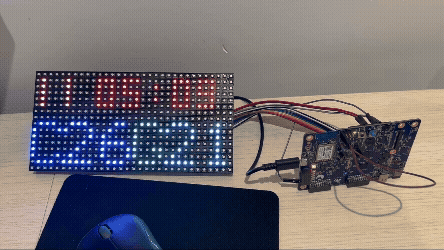
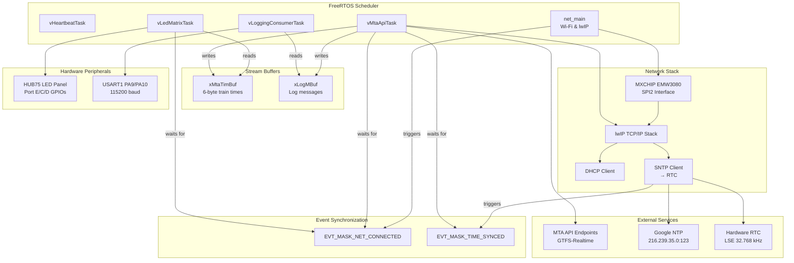
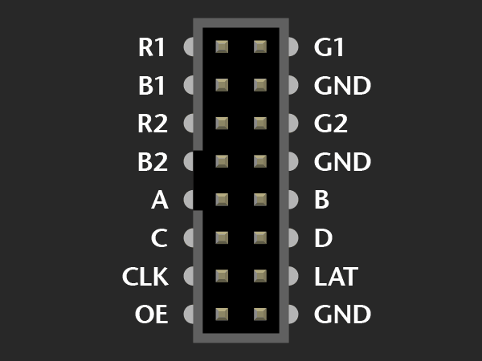

# MTA STM32U5 MXCHIP Wi-Fi Subway LED Display

## Technical Summary

Firmware for an STM32U585-based embedded display system that integrates FreeRTOS, a HUB75 LED matrix, MXCHIP Wi-Fi networking, lwIP, mbedTLS, and a custom MTA GTFS-Realtime protobuf client. The project initializes MCU peripherals, manages Wi-Fi connectivity and SNTP time sync, fetches encrypted MTA route updates, decodes rail arrival data, and renders a real-time C/G train board on a 32x16 LED panel.



## System Overview

A compact STM32U585 project that uses MXCHIP Wi-Fi, lwIP, mbedTLS, FreeRTOS, and a HUB75 32×16 panel to display live MTA arrival times.

### What it does

- Fetches secure GTFS-Realtime feeds
- Parses route and stop data
- Drives HUB75 refresh timing
- Keeps RTC time synced via SNTP
- Logs status to USART

## Hardware / Software Stack

- MCU: STM32U585 family.
- Board: B-U585I-IOT02A (STM32U5 Discovery kit) via CubeMX-generated project config.
- RTOS: FreeRTOS.
- Networking: lwIP stack, MXCHIP SPI/GPIO Wi-Fi module driver, DHCP, SNTP.
- Security: mbedTLS TLS client for HTTPS over lwIP.
- Display: HUB75 32x16 RGB LED panel driver with platform-specific pin mapping.
- Peripherals: SPI2, USART1, RTC, RNG, TIM2, GPIO, ICACHE, DCACHE, GPDMA, IWDG.

## Core Components

- `main.c`: HAL/clock/power initialization and RTOS startup.
- `app_freertos.c`: RTOS task creation, event synchronization, SNTP initialization, and launch order.
- `mta_task.c`: HTTPS client, mbedTLS session lifecycle, protobuf parsing, route-specific arrival extraction, and stream buffer dispatch.
- `mx_netconn.c`: Wi-Fi module initialization, connection state machine, netif control, DHCP, and reconnect logic.
- `led_matrix_task.c`: stream buffer consumption, RTC header formatting, vertical scrolling of C/G times, and HUB75 framebuffer updates.
- `hub75.c` + headers: low-level GPIO control, double-buffered bitplane generation, pixel drawing primitives, and buffer swap.
- `logging.c`: early and runtime logging paths, ISR-safe message buffering, UART transmission.
- `sntp_sync.c`: SNTP-to-hardware RTC update and event notification.


### Task connectivity




### LED matrix timing and HUB75

- `Common/hub75/Inc/hub75.h` defines the B-U585I-IOT02A pin mapping for a 32x16 HUB75 panel.
- `Common/hub75/hub75.c` initializes Port E data/color lines, Port C row address lines, and Port D control lines.
- `TIM2` is started in `HUB75_Init()` and its overflow callback in `Core/Src/tim.c` calls `HUB75_ISR()`.
- `HUB75_ISR()` blanks the panel, latches the row, updates the address multiplex lines, and steps through the BCM bitplane timing by updating `htim2.Instance->ARR`.
- `HUB75_SwapBuffers()` pre-encodes the active/clock phases into a double-buffered stream before the ISR consumes it.

#### HUB75 Pinout for STM32U5 Discovery Kit (B-U585I-IOT02A)



**Data Lines (Port E – Arduino Header CN14 & STMOD CN4):**
| Signal | Pin    | Arduino Header | Notes                                                    |
|--------|--------|----------------|----------------------------------------------------------|
| R1     | PE0    | D1             | Data line for red color (upper half)                    |
| G1     | PE7    | A4             | Data line for green color (upper half)                  |
| B1     | PE12   | D9             | Data line for blue color (upper half)                   |
| R2     | PE13   | D11            | Data line for red color (lower half)                    |
| G2     | PE14   | D12            | Data line for green color (lower half)                  |
| B2     | PE15   | D13            | Data line for blue color (lower half)                   |
| CLK    | PE4    | STMOD CN4      | **Moved to STMOD CN4 to keep on same GPIO port as data** |

**Address Lines (Port C – Arduino Header CN14):**
| Signal | Pin    | Arduino Header | Multiplexer |
|--------|--------|----------------|-------------|
| A      | PC0    | A5             | Row 0/8     |
| B      | PC2    | A6             | Row 1/9     |
| C      | PC4    | A7             | Row 2/10    |

**Control Lines (Port D – Arduino Header CN14):**
| Signal | Pin    | Arduino Header | Purpose                          |
|--------|--------|----------------|----------------------------------|
| OE     | PD8    | D10            | Output Enable (active low)       |
| STB    | PD9    | D15            | Strobe/Latch (active high)       |

**Configuration Notes:**
- All data lines (R1, G1, B1, R2, G2, B2) are on **Port E** for unified, single-port control and clock interleaving optimization.
- The clock line was moved from Port D to **PE4 on STMOD CN4** to keep all data signals on the same GPIO port, enabling efficient synchronized output and reducing critical path delays.

## Build and Setup Instructions

1. Clone the repository:
   ```bash
   git clone https://github.com/AlnurElberier/U5_mxchip_FreeRTOS
   cd mxchipFreertos
   ```

2. Open STM32CubeIDE and import the project:
   - **File** → **Import** → **Existing Projects into Workspace**
   - Select the cloned `mxchipFreertos` folder
   - Click **Finish**

3. Build the project:
   - Right-click the project in Project Explorer → **Build Project**
   - The output ELF `mtaTimes.elf` will be generated in the `Debug/` folder

4. Debug / Flash:
   - Connect ST-LINK to the board
   - Right-click the project → **Debug As** → **STM32 C/C++ Application**
   - CubeIDE will flash and launch the debugger

## Configuration Details

- Wi-Fi credentials are hard-coded in `Core/Inc/main.h`:
  - `SSID "Alnur"`
  - `PSWD "testtesttest"`
  - Edit these directly and rebuild to change Wi-Fi connection details.

- MTA feed endpoints are defined in `Core/Src/mta_task.c`:
  - `/Dataservice/mtagtfsfeeds/nyct%2Fgtfs-ace` (C/A/E trains)
  - `/Dataservice/mtagtfsfeeds/nyct%2Fgtfs-g` (G train)

- **Stop IDs and Route configuration** in `Core/Src/mta_task.c`:
  - **Stop IDs**: Hardcoded at line ~170 as `"A44N"` (Clinton-Washington Avs) and `"G35N"` (Clinton-Washington Avs)
    - To change, modify the `strcmp()` conditions in the `prvParseStopTimeUpdate()` function
    - Example: replace `strcmp(cStopId, "A44N")` with your target stop ID
  - **Route IDs**: Hardcoded at lines ~222 and ~232 as `"C"` and `"G"`
    - To add/change routes, modify the MTA feed endpoints above and update the route comparisons in `prvParseTripUpdate()`
    - The display expects a 6-byte stream: 3 minutes for the first route, 3 minutes for the second route
    - Route and stop information can be found in the MTA [Developer Resource Guide](https://www.mta.info/developers)

- The `led_matrix_task` expects a 6-byte stream buffer packet structured as three C-route minute values followed by three G-route values.
- `Common/include/sys_evt.h` defines runtime event bits for network and time synchronization.
- `Common/config/lwipopts.h` and `Common/net/lwip_port/include/lwipopts_freertos.h` configure lwIP behavior.
- The HUB75 driver pin definitions are centralized in `Common/hub75/Inc/hub75.h`

## Future Improvements

- No explicit test framework is included.
- Credential management is currently hard-coded and should be moved to a secure configuration store.
- Protobuf parsing is minimal and route/stop-specific; a generated schema parser could improve maintainability.
- Hardware RTC offset handling is fixed to UTC-4 in `sntp_sync.c`; timezone support is not generalized.
- ~~Add a system watchdog and stale-data detection path so the LED board does not display expired arrival values.~~
    - completed 8/22
- Add a configuration interface for route and stop selection, either via BLE or AT-style command handling, instead of hard-coded MTA route IDs.
- Extend the UI to show weather or a secondary data source in the top header area instead of only date/time.
- Custom PCB design in KiCad should be feasible by preserving the MXCHIP SPI/GPIO wiring and HUB75 pin mappings from this repo.